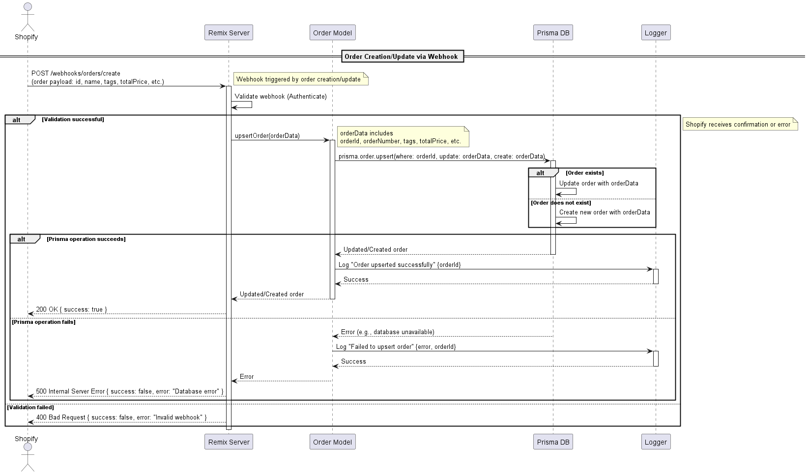
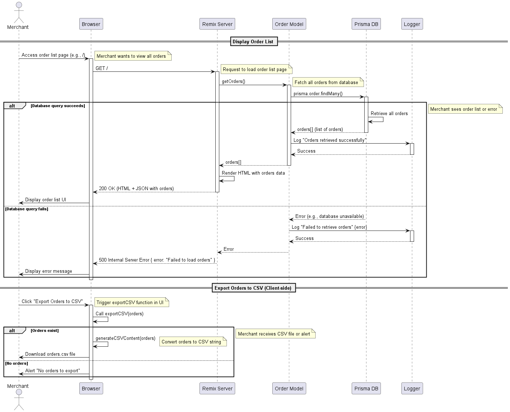
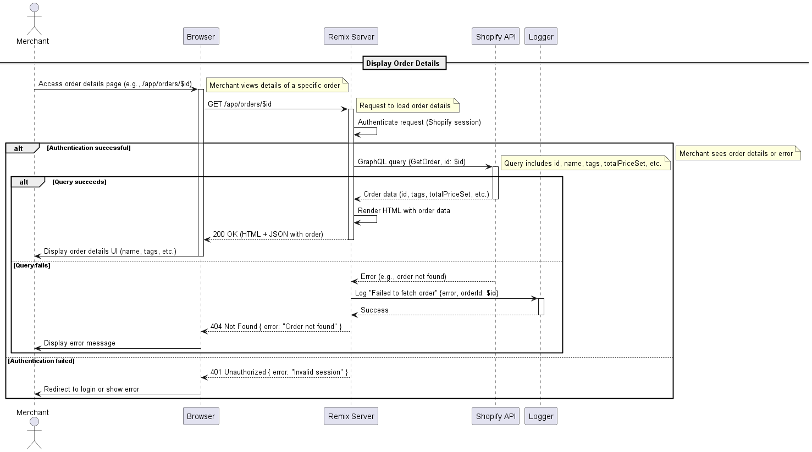
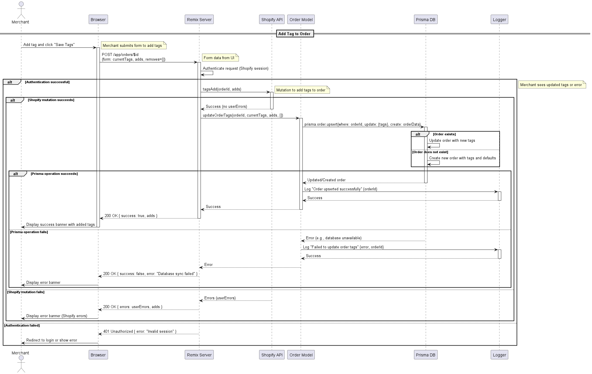
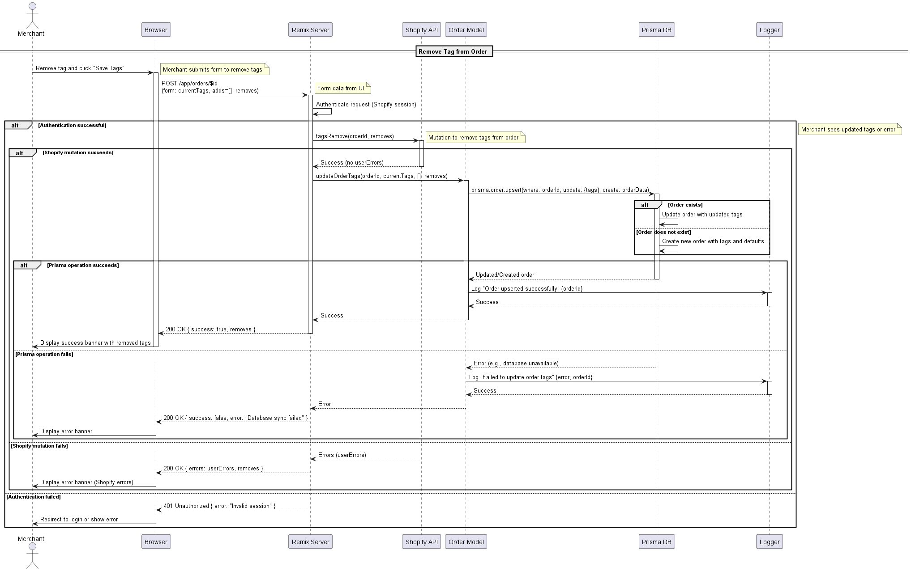

# Shopify Order Management App - Remix

This is a Remix-based application integrated with Shopify to manage orders. It allows merchants to view order lists, inspect order details, add/remove tags, and export orders to CSV. The app uses Prisma for local database management and Shopify's GraphQL API for real-time order data.

## Features

1. **Order List**: View all orders with basic details (order number, total price, tags).
2. **Order Details**: Display detailed order information (customer, total price, tags) fetched from Shopify API.
3. **Tag Management**: Add or remove tags from orders, synced with both Shopify and local Prisma database.
4. **Export to CSV**: Export orders to CSV using a client-side mechanism with Blob and dynamic link generation.
5. **Webhook Integration**: Sync order creation/updates from Shopify via webhooks.

## Quick start

### Prerequisites

Before you begin, you'll need the following:

1. **Node.js**: [Download and install](https://nodejs.org/en/download/) it if you haven't already.
2. **Shopify Partner Account**: [Create an account](https://partners.shopify.com/signup) if you don't have one.
3. **Test Store**: Set up either a [development store](https://help.shopify.com/en/partners/dashboard/development-stores#create-a-development-store) or a [Shopify Plus sandbox store](https://help.shopify.com/en/partners/dashboard/managing-stores/plus-sandbox-store) for testing your app.

### Setup

1. **Clone the repository**:

```shell
git clone https://github.com/datdd/remix-app-store.git
```

2. **Install dpendencies**:

```shell
npm install
```

3. **Register Shopify Webhooks**:

```shell
shopify app deploy
```

4. **Setup Prisma**:

```shell
shopify app deploy
```

5. **Register Shopify Webhooks**:

```shell
npx prisma migrate dev --name init
```

6. **Run the Application**:

```shell
shopify app dev
```

## Development

### Database

#### Order Model

```shell
model Order {
  id              Int      @id @default(autoincrement())
  orderId         String   @unique
  orderNumber     String
  totalPrice      String
  paymentGateway  String?
  customerEmail   String?
  customerFullName String?
  customerAddress String?
  tags            String?
  createdAt       DateTime
}
```
### Sequence Diagrams

#### Order Creation/Update via webhooks




#### Display Order Table and Export to CSV




#### Display Order Details




#### Add Tags to Order



#### Remove Tags from Order




## Benefits

Shopify apps are built on a variety of Shopify tools to create a great merchant experience.

<!-- TODO: Uncomment this after we've updated the docs -->
<!-- The [create an app](https://shopify.dev/docs/apps/getting-started/create) tutorial in our developer documentation will guide you through creating a Shopify app using this template. -->

The Remix app template comes with the following out-of-the-box functionality:

- [OAuth](https://github.com/Shopify/shopify-app-js/tree/main/packages/shopify-app-remix#authenticating-admin-requests): Installing the app and granting permissions
- [GraphQL Admin API](https://github.com/Shopify/shopify-app-js/tree/main/packages/shopify-app-remix#using-the-shopify-admin-graphql-api): Querying or mutating Shopify admin data
- [Webhooks](https://github.com/Shopify/shopify-app-js/tree/main/packages/shopify-app-remix#authenticating-webhook-requests): Callbacks sent by Shopify when certain events occur
- [AppBridge](https://shopify.dev/docs/api/app-bridge): This template uses the next generation of the Shopify App Bridge library which works in unison with previous versions.
- [Polaris](https://polaris.shopify.com/): Design system that enables apps to create Shopify-like experiences

## Tech Stack

This template uses [Remix](https://remix.run). The following Shopify tools are also included to ease app development:

- [Shopify App Remix](https://shopify.dev/docs/api/shopify-app-remix) provides authentication and methods for interacting with Shopify APIs.
- [Shopify App Bridge](https://shopify.dev/docs/apps/tools/app-bridge) allows your app to seamlessly integrate your app within Shopify's Admin.
- [Polaris React](https://polaris.shopify.com/) is a powerful design system and component library that helps developers build high quality, consistent experiences for Shopify merchants.
- [Webhooks](https://github.com/Shopify/shopify-app-js/tree/main/packages/shopify-app-remix#authenticating-webhook-requests): Callbacks sent by Shopify when certain events occur
- [Polaris](https://polaris.shopify.com/): Design system that enables apps to create Shopify-like experiences

## Resources

- [Remix Docs](https://remix.run/docs/en/v1)
- [Shopify App Remix](https://shopify.dev/docs/api/shopify-app-remix)
- [Introduction to Shopify apps](https://shopify.dev/docs/apps/getting-started)
- [App authentication](https://shopify.dev/docs/apps/auth)
- [Shopify CLI](https://shopify.dev/docs/apps/tools/cli)
- [App extensions](https://shopify.dev/docs/apps/app-extensions/list)
- [Shopify Functions](https://shopify.dev/docs/api/functions)
- [Getting started with internationalizing your app](https://shopify.dev/docs/apps/best-practices/internationalization/getting-started)
